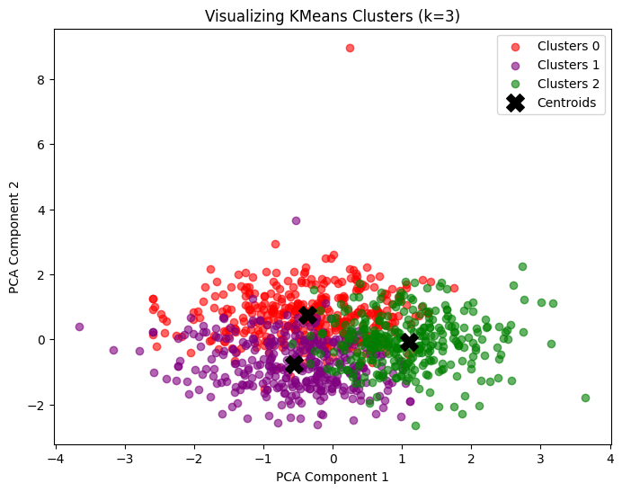
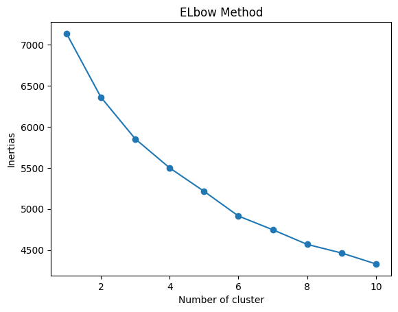
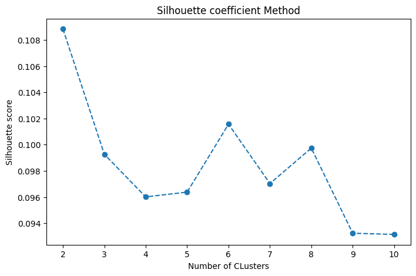
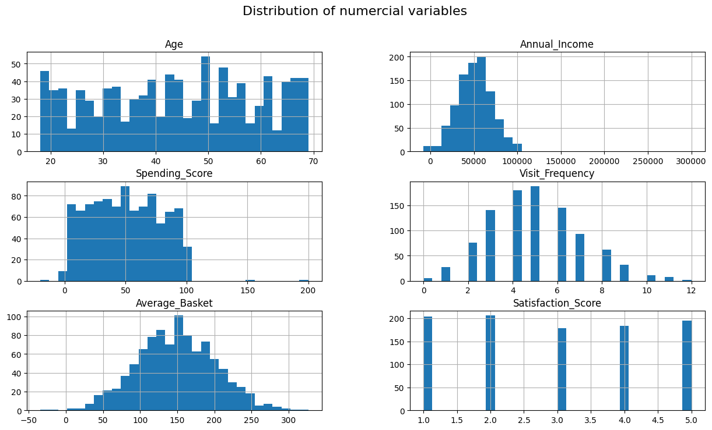

# Customer Segmentation for a Marketing Campaign

## 📌 Description

This project aims to segment a company's customers into distinct groups using unsupervised learning algorithms. The goal is to optimize marketing campaigns by offering tailored promotions to each customer segment.

## 📊 Objectives

- **Analyze** customer data to identify trends.
- **Segment** customers into homogeneous groups using clustering techniques.
- **Visualize** the results to interpret the segments.
- **Propose** marketing recommendations based on the insights.



## 📁 Project Structure

```
Customer_segmentation_for_a_Marketing_Campaign/
│-- data/
|-- |--customer_segmentation.csv                  
│-- notebooks/
|-- |-- __init__.py           
|-- |-- exploratory.ipynb
|-- |-- clustering.ipynb
|-- statics/
|-- |-- numerous of images files
|-- __init__.py        
│-- clustering.py
|-- .gitignore           
│-- requirements.txt
|--  README.md            
```



## 🛠️ Technologies and Libraries

- **Python**: Main language for data analysis
- **Pandas, NumPy**: Data manipulation and analysis
- **Scikit-learn**: Clustering algorithms and dimensionality reduction
- **Matplotlib, Seaborn**: Data visualization

## 📌 Project Steps

1. **Data Preparation**: Cleaning, normalization, and encoding of categorical variables.
2. **Data Exploration**: Visualization of distributions and correlations.
3. **Dimensionality Reduction**: PCA to simplify data.
4. **Choice of Optimal k** : Elbow and Silhouette Coefficient
5. **Clustering**: Applying K-Means and testing other methods.
6. **Interpretation and Recommendations**: Analysis of segments and tailored marketing strategies.



## 📊 Expected Results

- Identification of distinct customer segments.
- Visualizations of groups and their characteristics.
- Personalized marketing strategies for each segment.



## 🤝 Collaborate With Me

Do you work in education, humanitarian tech, or social impact analytics?  
Looking to deploy smart dashboards in your organization?

📩 Reach out: [abdiasarsene@gmail.com]  
🔗 LinkedIn: [Abdias Arsène. Z 📊📈](https://www.linkedin.com/in/abdias-arsene)

## 📩 Contact

If you have any questions or suggestions, feel free to contact me via LinkedIn! 😊
